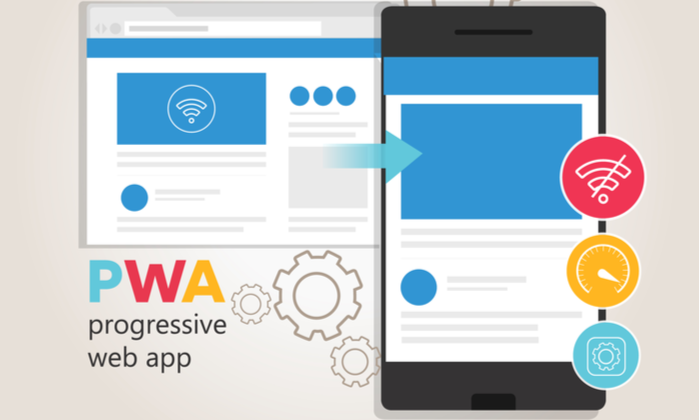
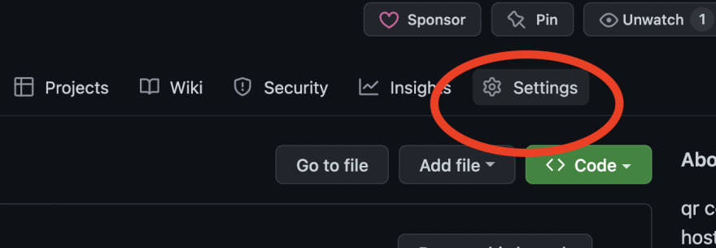
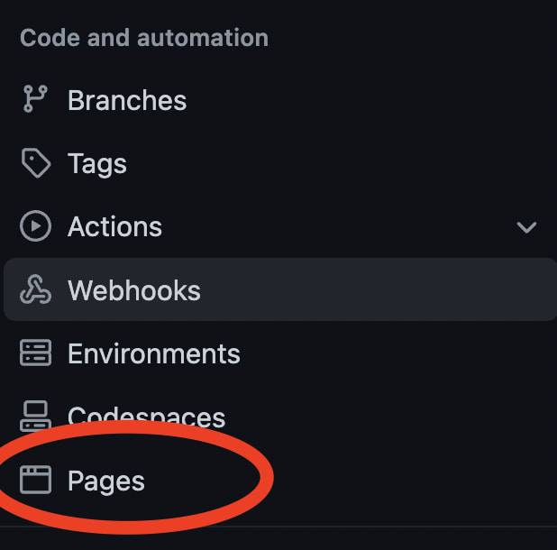
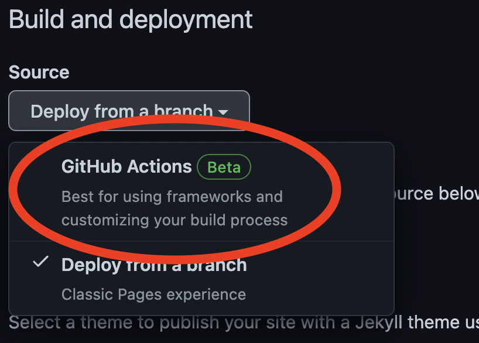
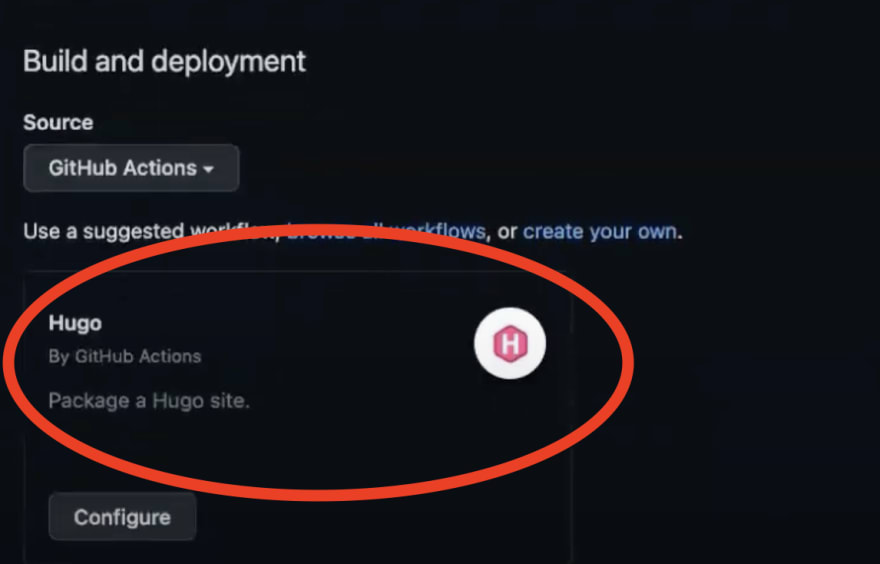
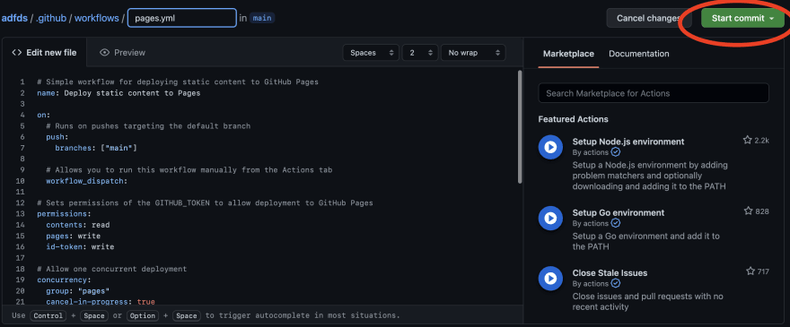
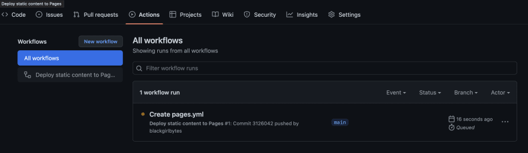
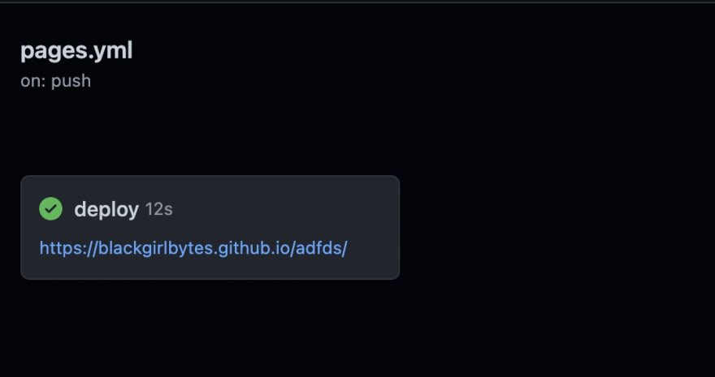
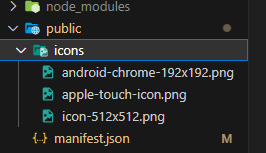

<h1> POC React Next.js pwa </h1>

</br>
<div align="center">
    </br>
</div>

</br>

<h3 align="center">
    <a href="https://g-aleprojetos-projects.github.io/poc-pwa-react-next">🔗 https://g-aleprojetos-projects.github.io/poc-pwa-react-next</a>
</h3>
</br>

 <p>Apresento um aplicativo desenvolvido com React e Next.js, utilizando a biblioteca next-pwa para transformá-lo em um Progressive Web App (PWA). O aplicativo foi hospedado no GitHub Pages, permitindo fácil acesso e disponibilidade.</p></br>

<p>Combinando a robustez do Next.js, incluindo suas capacidades de renderização do lado do servidor (SSR) e de pré-renderização, juntamente com a funcionalidade PWA fornecida pela biblioteca next-pwa, o aplicativo proporciona uma experiência ágil e responsiva aos usuários.</p></br>

<p>A interface intuitiva e amigável do aplicativo oferece recursos impressionantes, sendo adequado para diversos propósitos, como e-commerce, redes sociais, produtividade, entre outros. A integração das tecnologias React, Next.js, next-pwa e a hospedagem no GitHub Pages garante desempenho excepcional e uma experiência de usuário de alta qualidade.</p>
</br>
</br>

## Índice

- [O que é PWA](#o-que---pwa)
- [Por que usar o PWA](#por-que-usar-o-pwa)
- [Qual a vanagem de contruir um pwa com react nest.js](#qual-a-vanagem-de-contruir-um-pwa-com-react-nestjs)
- [Qual a vantagem de usar tudo isso no githube pages?](#qual-a-vantagem-de-usar-tudo-isso-no-githube-pages-)
- [Setup do projeto](#setup-do-projeto)
  * [Criação do projeto](#cria--o-do-projeto)
  * [Configura o projeto](#configura-o-projeto)
  * [Execute o servidor de desenvolvimento](#execute-o-servidor-de-desenvolvimento)
- [Preparação do projeto para o github pages](#prepara--o-do-projeto-para-o-github-pages)
- [Crie um repositório no gitHub e suba o projeto](#crie-um-reposit-rio-no-github-e-suba-o-projeto)
  * [navegue até a guia de configurações desse repositório.](#navegue-at--a-guia-de-configura--es-desse-reposit-rio)
  * [Clique em Pages na barra lateral esquerda](#clique-em-pages-na-barra-lateral-esquerda)
  * [Em Deploy for a branch, escolha GitHub Actions](#em-deploy-for-a-branch--escolha-github-actions)
  * [Isso irá sugerir alguns fluxos de trabalho para você com base no código em seu repositório. Você pode escolher o fluxo de trabalho compatível com sua base de código.](#isso-ir--sugerir-alguns-fluxos-de-trabalho-para-voc--com-base-no-c-digo-em-seu-reposit-rio-voc--pode-escolher-o-fluxo-de-trabalho-compat-vel-com-sua-base-de-c-digo)
  * [Clicar em configurar levará você a um fluxo de trabalho pré-criado. Sinta-se à vontade para revisar o YAML, ajustá-lo de acordo com sua preferência e confirmar o código.](#clicar-em-configurar-levar--voc--a-um-fluxo-de-trabalho-pr--criado-sinta-se---vontade-para-revisar-o-yaml--ajust--lo-de-acordo-com-sua-prefer-ncia-e-confirmar-o-c-digo)
  * [Em alguns segundos, sua ação começará a ser executada. Ele gerará um URL e implantará seu site estático no GitHub Pages se for bem-sucedido.](#em-alguns-segundos--sua-a--o-come-ar--a-ser-executada-ele-gerar--um-url-e-implantar--seu-site-est-tico-no-github-pages-se-for-bem-sucedido)
  * [Dirija-se ao seu URL nomeado <code>yourusername.github.io/your_repo_name</code> para verificar o seu site está pronto!](#dirija-se-ao-seu-url-nomeado--code-yourusernamegithubio-your-repo-name--code--para-verificar-o-seu-site-est--pronto-)
- [Criar o PWA](#criar-o-pwa)
  * [Configurar a página <code>layout.tsx</code> substituindo o metadata.](#configurar-a-p-gina--code-layouttsx--code--substituindo-o-metadata)
  * [Criar o `manifest.json` na pasta `public`](#criar-o--manifestjson--na-pasta--public)
  * [Colocar as imagens na pasta `public/icons`](#colocar-as-imagens-na-pasta--public-icons)
- [Fontes](#fontes)

<small><i><a href='http://ecotrust-canada.github.io/markdown-toc/'>Table of contents generated with markdown-toc</a></i></small>

## O que é PWA

<p>PWA é a sigla para Progressive Web App, que traduzido para o português significa "Aplicativo Web Progressivo". Um PWA é uma abordagem para o desenvolvimento de aplicativos web que combina características de sites e aplicativos móveis, oferecendo uma experiência semelhante à de um aplicativo nativo.</p>
</br>

## Por que usar o PWA

<p>Existem várias razões para usar PWA, mas resumidamente, as principais vantagens são:</p>
</br>
<ol>
    <li>Acessibilidade direta via URL, sem a necessidade de baixar e instalar pela loja de aplicativos.</li>
    <li>Funciona em diferentes dispositivos e plataformas.</li>
    <li>Funciona offline ou em condições de conectividade limitada.</li>
    <li>Atualizações automáticas para manter os usuários sempre na versão mais recente.</li>
    <li>Recursos avançados, como notificações push, para maior engajamento do usuário.</li>
    <li>Desenvolvimento ágil com tecnologias web padrão.</li>
</ol>

## Qual a vanagem de contruir um pwa com react nest.js

<p>Essas são as principais vantagens resumidas de construir um PWA com React e Next.js. Essas tecnologias combinadas oferecem eficiência, desempenho e suporte a recursos avançados de PWA.</p>
</br>
<ol>
    <li>Desenvolvimento eficiente com Next.js.</li>
    <li>Componentização e reutilização de código com React.</li>
    <li>Melhor desempenho com renderização do lado do servidor.</li>
    <li>Otimização para mecanismos de busca (SEO) com Next.js.</li>
    <li>Integração fácil com recursos de PWA usando next-pwa.</li>
    <li>Suporte da comunidade e ecossistema robusto.</li>
</ol>

## Qual a vantagem de usar tudo isso no githube pages?

<p>Essas são as principais vantagens resumidas de usar essa combinação no GitHub Pages. Isso proporciona uma hospedagem gratuita e fácil de usar, com recursos de controle de versão e colaboração, tornando-o uma opção conveniente para hospedar seu aplicativo React Next.js PWA.</p>
</br>
<ol>
    <li>Hospedagem gratuita no GitHub Pages.</li>
    <li>Implantação simplificada.</li>
    <li>Acesso global para os usuários.</li>
    <li>Plataforma confiável e escalável.</li>
    <li>Controle de versão e colaboração facilitados.</li>
</ol>
</br>

## Setup do projeto

### Criação do projeto

```bash
npx create-next-app@latest

```
### Configura o projeto

```bash
What is your project named? poc-pwa-react-next
Would you like to use TypeScript with this project? No / [Yes]
Would you like to use ESLint with this project? No / [Yes]
Would you like to use Tailwind CSS with this project? No / [Yes]
Would you like to use `src/` directory with this project? No / [Yes]
Use App Router (recommended)? No / [Yes]
Would you like to customize the default import alias? [No] / Yes
```

### Execute o servidor de desenvolvimento

```bash
npm run dev
# or
yarn dev
# or
pnpm dev
```
 
<h3>Abra <a href="http://localhost:3000">🔗 http://localhost:3000</a> com seu navegador para ver o resultado.</h3>
</br>

## Preparação do projeto para o github pages

<p>Na pasta <code>next.config.js</code> acrescente o <code>output: 'export'</code> no <code>nextConfig</code> como solicitado na documentação <a href="https://nextjs.org/docs/app/building-your-application/deploying/static-exports">🔗 nextjs/static-exports</a></p>

```
/**
 * @type {import('next').NextConfig}
 */
const nextConfig = {
  output: 'export',
  // Optional: Add a trailing slash to all paths `/about` -> `/about/`
  // trailingSlash: true,
  // Optional: Change the output directory `out` -> `dist`
  // distDir: 'dist',
}
 
module.exports = nextConfig
```
<p>Acrescente pontos no endereço das imagens, pois o githube pages não encontra se tiver apenas /</p>

<h3>Exemplo </h3>

```
 <Image
      className="relative dark:drop-shadow-[0_0_0.3rem_#ffffff70] dark:invert"
      src="./next.svg" //Aqui foi acrecentado o ponto na frente da barra
      alt="Next.js Logo"
      width={180}
      height={37}
      priority
    />
```

## Crie um repositório no gitHub e suba o projeto

### navegue até a guia de configurações desse repositório.


</br>
</br>

### Clique em Pages na barra lateral esquerda


</br>
</br>

### Em Deploy for a branch, escolha GitHub Actions


</br>
</br>

### Isso irá sugerir alguns fluxos de trabalho para você com base no código em seu repositório. Você pode escolher o fluxo de trabalho compatível com sua base de código.


</br>
</br>

### Clicar em configurar levará você a um fluxo de trabalho pré-criado. Sinta-se à vontade para revisar o YAML, ajustá-lo de acordo com sua preferência e confirmar o código.


</br>
</br>


### Em alguns segundos, sua ação começará a ser executada. Ele gerará um URL e implantará seu site estático no GitHub Pages se for bem-sucedido.


</br>
</br>

### Dirija-se ao seu URL nomeado <code>yourusername.github.io/your_repo_name</code> para verificar o seu site está pronto!


</br>
</br>

## Criar o PWA

<h3>baixar a biblioteca <a href="https://www.npmjs.com/package/next-pwa">🔗 next-pwa</a></h3>

### Configurar a página <code>layout.tsx</code> substituindo o metadata.

```
const APP_NAME = "next-pwa example";
const APP_DESCRIPTION = "This is an example of using next-pwa plugin";

export const metadata: Metadata = {
  title: "POC PWA React Next",
  description: APP_DESCRIPTION,
  applicationName: APP_NAME,
  appleWebApp: {
    capable: true,
    title: APP_NAME,
    statusBarStyle: "default",
  },
  formatDetection: {
    telephone: false,
  },
  viewport:
    "minimum-scale=1, initial-scale=1, width=device-width, shrink-to-fit=no, viewport-fit=cover",
  manifest: "./manifest.json",
  icons: [
    { rel: "apple-touch-icon", url: "./icons/apple-touch-icon.png" },
    { rel: "shortcut icon", url: "./favicon.ico" },
  ],
  keywords: ["nextjs", "pwa", "next-pwa"],
};
```

### Criar o `manifest.json` na pasta `public`

```
{
  "name": "POC React next pwa",
  "short_name": "App",
  "description": "Apresento um aplicativo desenvolvido com React e Next.js, utilizando a biblioteca next-pwa para transformá-lo em um Progressive Web App (PWA). O aplicativo foi hospedado no GitHub Pages, permitindo fácil acesso e disponibilidade.",
  "display": "fullscreen",
  "orientation": "portrait",
  "theme_color": "#20232a",
  "background_color":"#282c34",
  "start_url": ".",
  "icons": [
    {
      "src": "./icons/android-chrome-192x192.png",
      "sizes": "192x192",
      "type": "image/png",
      "purpose": "any maskable"
    },
    {
      "src": "./icons/icon-512x512.png",
      "sizes": "512x512",
      "type": "image/png"
    }
  ],
  "manifest_version": 1,
  "version": "0.1"
}
```
<h3>Descrição</h3>
<ul>
    <li><strong>name</strong> - exibido na tela inicial abaixo do ícone do aplicativo</li>
    <li><strong>short_name</strong> - exibido abaixo do atalho na área de trabalho ou na tela inicial</li>
    <li><strong>description</strong> - uma descrição geral da aplicação</li>
    <li><strong>display</strong> - especifica o modo de exibição. Aqui estão os diferentes modos disponíveis classificados por ordem de fallback:</li>
    <ul>
        <li><strong>fullscreen</strong>: toda a área de exibição disponível é usada e nenhuma interface de usuário do navegador é mostrada.</li>
        <li><strong>standalone</strong>: olhe e sinta-se como um aplicativo independente. Isso significa que o aplicativo terá sua própria janela, seu próprio ícone no ativador e assim por diante. Nesse modo, o agente do usuário excluirá elementos da interface do usuário para controlar a navegação, mas poderá incluir outros elementos da interface do usuário, como uma barra de status.</li>
        <li><strong>minimal-ui</strong>: o aplicativo será parecido com um aplicativo independente, mas terá um conjunto mínimo de elementos de interface do usuário para controlar a navegação. Esses elementos variam de acordo com o navegador e o sistema.</li>
        <li><strong>browser (default)</strong>: o aplicativo é aberto em uma guia do navegador convencional ou em uma nova janela, dependendo do navegador e da plataforma.</li>
    </ul>
    <li><strong>orientation</strong> - define a orientação padrão para dispositivos móveis: any, natural,landscape, portrait...</li>
    <li><strong>theme_color</strong> - a cor do tema geral do aplicativo, usada nas barras de status, por exemplo, se forem exibidas</li>
    <li><strong>background_color</strong> - a cor de fundo da tela inicial</li>
    <li><strong>start_url</strong> - a URL que é carregada primeiro quando você abre o aplicativo a partir do atalho</li>
    <li><strong>icons</strong> - A `icons` chave especifica ícones para sua extensão. Esses ícones serão usados ​​para representar a extensão em componentes como o Gerenciador de complementos. Consiste em pares chave-valor de tamanho de imagem em px e caminho de imagem relativo ao diretório raiz da extensão.</li>
    <li><strong>manifest_version</strong> - Esta chave especifica a versão de manifest.json usada por esta extensão.</li>
    <li><strong>version</strong> - A string de versão para a extensão.</li>
</ul>
</br>
</br>

### Colocar as imagens na pasta `public/icons`


</br>
</br>

<h3>Agora é só subir o projeto para o github</h3>
</br>
</br>

## Fontes

<a href="https://dev.to/github/how-to-host-a-static-nextjs-site-on-github-pages-4pe0">🔗 How to host a Hugo or Next.js site on GitHub Pages</a></p>
<a href="https://youtu.be/WoL3xbkAfOU">🔗 How to host next js app on GitHub pages using GitHub Actions | CI/CD</a></p>